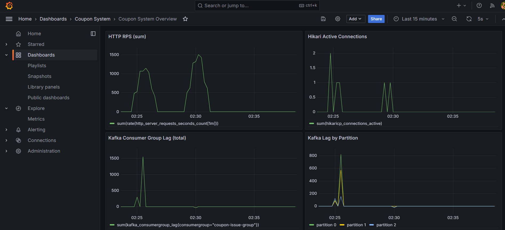

# Phase 5: Scale Out + Nginx 성능 검증 결과

## 목표

Kafka 비동기 발급(응답 경로 Redis + Kafka, DB는 Consumer 처리)을 유지한 상태에서,
Nginx + 다중 앱 인스턴스 구성이 단일 인스턴스 대비 처리율을 개선하는지 검증한다.

---

## 실험 범위

- 비교 대상
  - `8080`: 단일 앱 인스턴스 직접 호출
  - `8081`: Nginx -> app1/app2/app3 로드밸런싱
- 부하
  - k6 `constant-arrival-rate`
  - rate: `3000, 4000, 5000`
  - 각 rate 3회 반복
- 공통 조건
  - 테스트 전 `coupon_issue` 초기화
  - 테스트 전 Redis 카운터 초기화
  - Kafka 토픽 `coupon-issue` 파티션 3개

---

## 결과 1) 8081 (Nginx + 다중 앱)

| rate | runs | avgReqPerSec | avgFailedPct | avgP95Ms | avgDropped | avgDbDelta |
|------|------|--------------|--------------|----------|------------|------------|
| 3000 | 3 | 2723.30 | 6.21% | 1123.93 | 2283 | 2796 |
| 4000 | 3 | 2986.91 | 5.26% | 1520.90 | 8091 | 3260 |
| 5000 | 3 | 2657.75 | 5.99% | 2285.74 | 20532 | 3202 |

해석:
- 3000 -> 4000 구간에서 처리율 증가.
- 5000에서는 처리율 하락, dropped 급증, p95 악화로 포화 구간 진입.

---

## 결과 2) 8080 (단일 인스턴스 직접 호출)

| rate | runs | avgReqPerSec | avgFailedPct | avgP95Ms | avgDropped | avgDbDelta |
|------|------|--------------|--------------|----------|------------|------------|
| 3000 | 3 | 2765.39 | 2.62% | 576.94 | 1690 | 1900 |
| 4000 | 3 | 3438.13 | 0.07% | 660.68 | 4443 | 1825 |
| 5000 | 3 | 3530.90 | 0.92% | 755.71 | 12239 | 2077 |

해석:
- 전 구간에서 8081 대비 실패율/지연이 낮고 처리율이 높음.
- 5000에서도 8081 대비 상대적으로 안정적.

---

## 결과 3) Nginx access_log ON/OFF 비교 (8081)

| mode | runs | avgReqPerSec | avgFailedPct | avgP95Ms | avgDropped |
|------|------|--------------|--------------|----------|------------|
| log off | 3 | 1250.52 | 19.89% | 6180.00 | 33356 |
| log on | 3 | 2136.39 | 7.88% | 3450.00 | 24217 |

해석:
- 이번 측정 세트에서는 `log on`이 더 우수하게 측정됨.
- 단일 런 편차가 커서, 로그 설정 단독 효과로 단정하지 않고 반복 교차 측정이 필요.

---

## Kafka 파티션 3개 검증

- 토픽 상태: `PartitionCount=3`
- consumer group 조회 시 파티션 0/1/2가 서로 다른 consumer에 할당됨
  - 예: `/172.18.0.5`, `/172.18.0.6`, `/172.18.0.7`
- 결론: Kafka 소비 병렬성(파티션 분산)은 정상 동작

---

## 결과 4) Consumer 배치 처리 튜닝 후 재측정 (8081)

적용 내용:
- Kafka listener 배치 모드 전환 (`type=batch`, `ack-mode=batch`, `concurrency=3`)
- consumer fetch/poll 튜닝 (`max-poll-records=500`)
- DB 저장 경로 배치 insert 전환 (`INSERT IGNORE` 기반)

| rate | runs | avgReqPerSec | avgFailedPct | avgP95Ms | avgDropped | avgDbDelta |
|------|------|--------------|--------------|----------|------------|------------|
| 3400 | 3 | 2695.65 | 6.64% | 1253.02 | 4517 | 4345 |
| 3500 | 3 | 3151.74 | 6.33% | 996.48 | 2498 | 5368 |
| 3600 | 3 | 3211.75 | 6.05% | 912.25 | 2939 | 5322 |

해석:
- 튜닝 후 8081 기준 최적 구간은 `3500~3600`으로 수렴.
- `3600`에서 평균 처리율/지연이 가장 좋고, `3500`은 dropped가 더 낮아 안정성 측면에서 유리.

---

## 결론

1. 이번 Phase 5 실험에서는 `8081(Nginx+다중 앱)`가 `8080(단일 직접)`보다 성능이 낮게 측정되었다.
2. 병목은 Kafka 소비 분산 자체보다는 인입 경로(Nginx/프록시 계층 및 그 주변 자원) 쪽에 더 가깝다.
3. `8081`은 초기 측정에서 rate 4000 이후 포화 징후가 뚜렷했으며, consumer 배치 튜닝 후에는 실효 최적 구간이 `3500~3600`으로 개선되었다.

---

## 지표 해석 주의사항

- consumer 배치 처리 + Redis 보정 로직 실험 과정에서, 일부 런은 `redisDelta`가 과소 집계되는 현상이 확인되었다.
- 따라서 최종 성능 해석은 `req/s`, `failed%`, `p95`, `dropped`, `DB delta`, `Kafka lag` 중심으로 수행했다.
- `redisDelta`는 해당 실험 구간에서는 참고 지표로만 사용한다.

---

## 다음 단계 (Phase 6)

- 목표: 튜닝 반복보다 **관측 가능성 강화**로 병목 근거를 정량화한다.
- 수행 항목:
  - Prometheus + Grafana 구성
  - Nginx/app/Kafka/MySQL 핵심 지표 대시보드 구성
  - 부하 테스트 결과와 시스템 지표(큐 대기, 커넥션, lag, DB 처리율) 상관관계 분석
- 기대 결과: "어디서 느려지는지"를 로그 추정이 아닌 시계열 지표로 설명 가능

---

## 참고 스크립트

- `scripts/run-k6-with-check.ps1`: 단일 런 전/후(Redis, DB, Kafka) 확인
- `scripts/run-k6-rate-matrix.ps1`: rate 매트릭스 반복 실행 + 표 출력
- `scripts/switch-nginx-mode.ps1`: Nginx mode 전환(default/bench)

---

## 현재까지 중간 정리

### 1) 8081 성능 특성

- 단순히 앱 인스턴스를 3대로 늘리는 것만으로는 `8080` 대비 우위를 만들기 어려웠다.
- `8081`은 부하가 올라갈수록 `dropped`, `p95` 악화가 먼저 나타났고, 인입 경로(프록시/큐 대기) 영향이 컸다.
- 재측정 기준으로 `8081`의 실효 최적 구간은 `3500~3600` 부근으로 수렴했다.

### 2) Kafka 파티션/분산 이해

- 파티션 3개와 consumer 3개 할당은 정상 동작했다.
- 파티션 분산은 해시 기반이므로 완전 균등을 보장하지 않으며, 파티션별 lag 편차가 발생할 수 있다.
- 따라서 모니터링은 `total lag`뿐 아니라 `partition별 lag`도 함께 보는 것이 필요하다.

### 3) Consumer 처리 튜닝

- listener를 batch 모드로 전환하고 DB 저장을 배치 insert로 바꿨다.
- Redis 보정도 건별 decrement에서 집계 decrementBy로 바꿔 round-trip을 줄였다.
- JDBC URL에 batch 최적화 옵션을 적용해 배치 insert 효율을 높였다.

### 4) 지표 해석 원칙

- 실험 구간에 따라 `redisDelta`가 보정 로직 영향으로 왜곡될 수 있어 참고 지표로만 사용한다.
- 최종 해석은 `req/s`, `failed%`, `p95`, `dropped`, `DB delta`, `Kafka lag` 중심으로 수행한다.
- RPS는 초당 요청 처리량(양) 지표이며, 성공/지연/안정성은 별도 지표로 함께 봐야 한다.

### 5) 모니터링 세팅 완료

- Actuator + Prometheus registry 적용, Prometheus/Grafana/kafka-exporter를 Docker Compose에 추가했다.
- Grafana datasource/대시보드 프로비저닝을 적용했고, Kafka lag 패널은 exporter metric으로 확인 가능하다.
- 운영상 핵심 대시보드 항목: HTTP RPS, 5xx 비율, p95 latency, Hikari active, total lag, partition lag.

- Figure: Phase 5 실험 중 Grafana 대시보드 캡처 (HTTP 성능 지표 + Kafka lag 관측)

### 6) 다음 액션

- Phase 5 마무리는 현재 수치와 해석으로 충분하다.
- 다음 Phase에서는 Prometheus/Grafana 시계열 기반으로 병목 근거를 정량화하고, 튜닝 전/후를 동일 패널로 비교한다.
